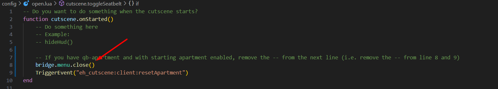

# ZSX Multicharacter

If you're using `ZSX_Multicharacter`, you may need to make some additional modifications. Follow the instructions below based on your clothing script. _<mark style="color:orange;">**If you're not using**</mark><mark style="color:orange;">** **</mark><mark style="color:orange;">**`ZSX_Multicharacter`**</mark><mark style="color:orange;">**, you can skip this section**</mark>._




If you're using `qb-clothing`, no additional modifications are needed as long as you've already configured it and followed [this step](zsx-multicharacter.md#qb-clothing).




1. Navigate to <mark style="color:yellow;">`framework_functions.lua`</mark> in the <mark style="color:yellow;">`ZSX_Multicharacter/client/framework`</mark> folder.
2. Locate the following line in the file:

```lua
exports['illenium-appearance']:startPlayerCustomization(function (skin)
```

3. Just below the line `HandleHud(false)` (around line 92), insert the following code:

```lua
TriggerEvent("eh_cutscene:client:StartCutscene") -->> Start eh_cutscene
print('^2Started eh_cutscene')
```

<figure><figcaption><p>This is how the modified client code should look like</p></figcaption></figure>


