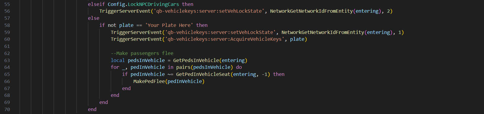

# QB-Vehiclekeys

If you're using `qb-vehiclekeys` and NPC vehicles are set to unlock, follow these steps:



1. Open the <mark style="color:yellow;">`main.lua`</mark> file in the <mark style="color:yellow;">`qb-vehiclekeys/client`</mark> folder.
2. Go to line 58, and modify the file as shown below:

```lua
else -- line 57
    if not plate == 'Your Plate Here' then
        TriggerServerEvent('qb-vehiclekeys:server:setVehLockState', NetworkGetNetworkIdFromEntity(entering), 1)
        TriggerServerEvent('qb-vehiclekeys:server:AcquireVehicleKeys', plate)

        --Make passengers flee
        local pedsInVehicle = GetPedsInVehicle(entering)
        for _, pedInVehicle in pairs(pedsInVehicle) do
            if pedInVehicle ~= GetPedInVehicleSeat(entering, -1) then
                MakePedFlee(pedInVehicle)
            end
        end
    end
end
```

3. Replace <mark style="color:yellow;">`'Your Plate Here'`</mark> with your taxi's actual number plate (e.g., <mark style="color:yellow;">`'ERRORHUB'`</mark>) on line 58.

<figure><figcaption><p>This is how the modified code should look like</p></figcaption></figure>



1. Search for <mark style="color:yellow;">`SetVehicleDoorsLocked(entering, 1)`</mark> in the <mark style="color:yellow;">`main.lua`</mark> file.
2.  Replace it with the following code:

    ```lua
    if not plate == 'Your Plate Here' then 
        SetVehicleDoorsLocked(entering, 1)
    end
    ```
3. Replace <mark style="color:yellow;">`'Your Plate Here'`</mark> with your taxi's actual number plate (e.g., <mark style="color:yellow;">`'ERRORHUB'`</mark>). For Example:

```lua
if not plate == 'ERRORHUB' then 
    SetVehicleDoorsLocked(entering, 1)
end
```




