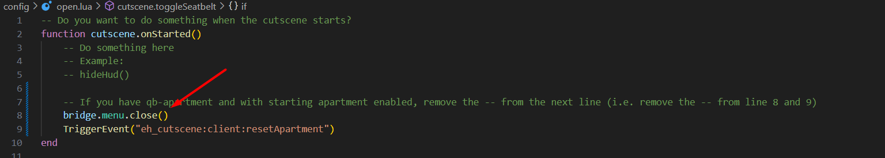

# QB-Apartment

If you're using [qb-apartments](https://github.com/qbcore-framework/qb-apartments) with the starting apartment enabled (i.e., `Apartments.Starting` is set to `true` in `qb-apartments/config`), you must follow these steps. Otherwise, you can skip this setup:

1. Open the <mark style="color:yellow;">`main.lua`</mark> file in the <mark style="color:yellow;">`qb-apartments/client`</mark> folder.
2. Insert the following code at the bottom of the <mark style="color:yellow;">`main.lua`</mark> file:

```lua
RegisterNetEvent("eh_cutscene:client:resetApartment", function()
    if not InApartment then return end
    TriggerServerEvent('qb-apartments:returnBucket')
    exports['qb-interior']:DespawnInterior(HouseObj, function()
        TriggerEvent('qb-weathersync:client:EnableSync')
        Wait(1000)
        TriggerServerEvent('apartments:server:RemoveObject', CurrentApartment, ClosestHouse)
        TriggerServerEvent('qb-apartments:server:SetInsideMeta', CurrentApartment, false)
        CurrentApartment = nil
        InApartment = false
        CurrentOffset = 0
        TriggerServerEvent('apartments:server:setCurrentApartment', nil)
        DeleteInApartmentTargets()
        DeleteApartmentsEntranceTargets()
    end)
end)
```

3. Open the <mark style="color:yellow;">`open.lua`</mark> file in the <mark style="color:yellow;">`eh_cutscene/config`</mark> folder.
4. Search for the function `cutscene.onStarted()` on line 1, then find and uncomment lines 8-9 (approx). Your function should look somewhat like the example below—just remove the `--` from lines 8 and 9 to enable them.

<figure><figcaption></figcaption></figure>

